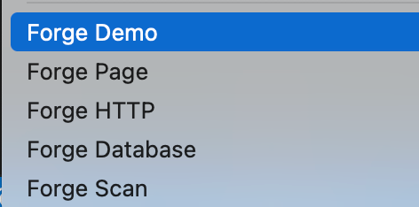

# Flutter Project Forge
## Project Introduction
This is a VS Code extension used for automatically generating Flutter project codes. 
## Function Features
- Forge Demo: Quickly generate project template codes.
- Forge HTTP: Generate HTTP interface request template codes.
- Forge Database: Generate codes for creating database connection.
- Forge Page: Add a new page.

## 项目介绍
这是一款用于自动生成 Flutter 项目代码的扩展插件。
## 功能特性
- Forge Demo:：快速生成项目模板代码。
- Forge HTTP：生成 HTTP 接口请求模板代码。
- Forge Database：生成用于创建数据库连接的代码。
- Forge Page：添加新页面。