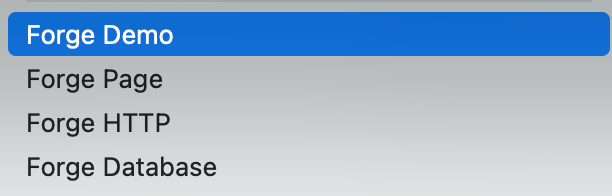

[中文](README.zh.md)

# Flutter Project Forge
## Project Introduction
This is a VS Code extension used for automatically generating Flutter project codes. 
## Function Features
- Forge Demo: Quickly generate project template codes.
- Forge HTTP: Generate HTTP interface request template codes.
- Forge Database: Generate codes for creating database connection.
- Forge Page: Add a new page.
- Forge Scan: Add QR code scanning feature to Flutter project

## Usage
1. Install the extension from the VS Code Marketplace.
2. Right-click on a Flutter project folder in VS Code.
3. Choose the desired function from the context menu.
4. Follow the prompts to generate the desired code.

